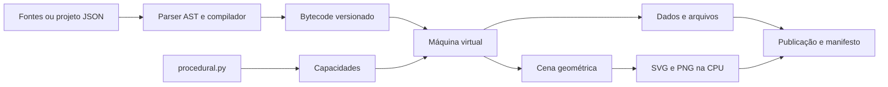

# Arquitetura e limites

O núcleo independente não depende da plataforma. A plataforma depende dele e adiciona contratos executáveis.

## Fronteiras

- `procedural.py`: geração, aleatoriedade, ruído, gramáticas e reescrita genérica; Python normal e saída arbitrária.
- `compiler.py`: valida o subconjunto sintático e produz instruções, sem executar a fonte.
- `bytecode.py`: serialização, validação de operandos e digest estável.
- `vm.py`: pilha, frames, ambientes e capacidades explicitamente registradas.
- `project.py`: fontes e resolução de módulos em memória.
- `runner.py`: processo filho encerrável e resultados estruturados.
- `artifacts.py`: nomes, tamanho, hashes e publicação por renomeação de diretório temporário.
- `geometry.py`: registros de cena e visualização simples, sem ligação ao GPU.
- `backends.py`: outra IR, restrita a expressões aritméticas; não usa o bytecode PCL como se fosse um transpiler universal.

## Determinismo

O núcleo deriva fluxos por semente e endereço, sem `hash()` dependente de processo nem RNG global. Os experimentos separam inicialização, treino e avaliação. Benchmarks conferem que todas as amostras produzem o mesmo hash.

Registrar novo gerador não altera outros fluxos. Alterar uma implementação pode alterar resultados; uma alteração dessas precisa de versão explícita e atualização de vetores de referência. O núcleo copiado para este repositório mantém o SHA-256 da entrega anterior.

## Execução e isolamento

A VM impede imports arbitrários e introspecção de objetos host pela sintaxe suportada. Isso reduz a superfície exposta, mas não constitui uma garantia de sandbox de segurança. A CLI usa processo separado para encerrar trabalho que ultrapassa o limite de relógio, inclusive dentro de uma capacidade.

Não há isolamento de rede/filesystem nem limites de memória por cgroup/rlimit. Para receber programas de terceiros em serviço público, o próximo estágio exige isolamento do sistema operacional, cotas de memória e uma avaliação de segurança específica.

## Persistência

Saídas usam `procedural.run/1`, com semente, versão, hashes de todos os módulos e SHA-256 de cada artefato. O destino precisa ser novo. Uma falha antes da publicação elimina o staging. Esse mecanismo não oferece durabilidade transacional contra falha de energia nem garantia de exclusão entre escritores externos concorrentes.

## Desempenho observado

`benchmarks/runtime_report.json` registra seis casos: RNG, terrain, graph, rewrite, compiler e VM. Memória é observada por `tracemalloc`; não inclui toda a memória nativa ou do processo. Temporização sob tracing tem overhead.

Ruído mantém caches limitados por contexto para evitar recalcular vértices de lattice. Reescrita ainda busca matches diretamente; grafo com muitos edges ainda enumera candidatos. Não há justificativa experimental para reescrever tudo em Rust/C++. Um futuro componente nativo deve demonstrar benefício e manter o contrato.

## Maturidade

Esta entrega tem CLI, wheel instalável, testes, CI e exemplos. Ainda faltam depurador interativo, tipos estáticos, verificação completa do bytecode, cancelamento fino dentro das capacidades, pacote de extensões com versões e teste de longa duração. O plano distingue trabalho atual e futuro em ROADMAP.md.
